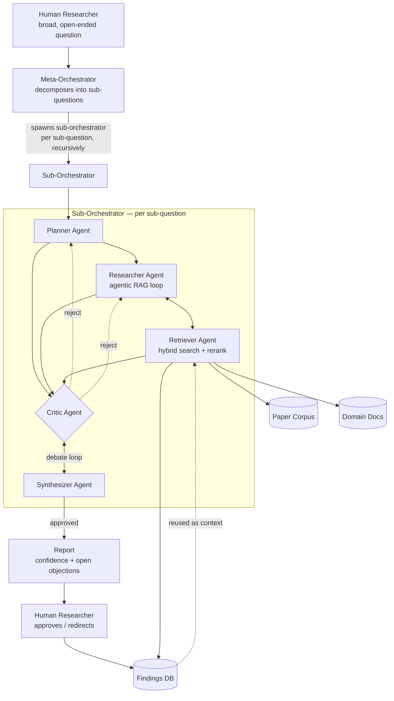

# Prometheus

**A multi-agent framework for human-centric research and investigation.**

Prometheus takes a broad, open-ended research question, decomposes it into
sub-questions, gathers and reranks evidence across multiple sources, forms
hypotheses, runs an adversarial critique pass, and presents a report with
explicit confidence levels and any unresolved objections. The human
researcher retains final authority at every checkpoint — Prometheus
accelerates and sharpens the investigation, it does not replace judgment.

This repo is currently a **skeleton**: folder structure, module
responsibilities, and function signatures are in place as `NotImplementedError`
stubs with docstrings describing what each piece needs to do. Nothing runs
yet. Treat the phases below as the build order.

## Architecture



Full component-by-component breakdown, plus the open design questions still
to resolve, live in **[`docs/architecture.md`](docs/architecture.md)**. Edit
the Mermaid source directly as the design evolves.

## Repo layout

```
prometheus/
├── docs/
│   └── architecture.md        # detailed diagram + component notes
├── src/prometheus/
│   ├── config.py              # central Settings, loaded from .env
│   ├── graph/                 # LangGraph orchestration
│   │   ├── meta_orchestrator.py
│   │   └── sub_orchestrator.py
│   ├── agents/                # the five agent roles
│   │   ├── planner.py
│   │   ├── researcher.py
│   │   ├── retriever.py
│   │   ├── critic.py
│   │   └── synthesizer.py
│   ├── retrieval/             # hybrid search over the four data stores
│   │   ├── sources/           # arxiv / semantic scholar / openalex clients
│   │   ├── ingestion.py       # parse -> chunk -> embed -> index
│   │   ├── vector_store.py    # Chroma/Qdrant wrapper
│   │   ├── hybrid_search.py   # BM25 + dense + store routing
│   │   └── reranker.py        # cross-encoder + recency/credibility filters
│   ├── findings/              # Findings DB models + repository
│   ├── mcp/                   # MCP server (search_papers, save_report)
│   └── evaluation/            # RAGAS + LLM-judge ensemble
├── app/
│   └── streamlit_app.py       # dashboard: agent hierarchy, debate, report
├── scripts/                   # ingest_papers.py, seed_findings_db.py
├── tests/
├── .env.example
├── pyproject.toml
└── .gitignore
```

## Tech stack

| Layer | Choice |
|---|---|
| Orchestration | LangGraph (recursive multi-agent graphs, conditional edges, checkpointing, human-in-the-loop, time-travel debugging) |
| Inference | Anthropic Claude models, per-role hyperparameter tuning |
| Retrieval | arXiv / Semantic Scholar / OpenAlex APIs; ChromaDB or Qdrant; cross-encoder reranking |
| Persistence | PostgreSQL/SQLite, exposed via MCP tools (`search_papers()`, `save_report()`) |
| Evaluation | RAGAS (retrieval faithfulness) + rubric-based LLM-judge ensemble |
| Observability | LangSmith tracing |
| Interface | Streamlit dashboard |

## Getting started

```bash
python -m venv .venv && source .venv/bin/activate
pip install -e ".[dev]"
cp .env.example .env   # fill in OPENROUTER_API_KEY at minimum
```

Nothing is runnable end-to-end yet — start with Phase 0 below.

---

## Build phases

Each phase lists its goal and concrete tasks. Check items off as you go;
phases can overlap somewhat (e.g. start Phase 1 ingestion work while still
finishing Phase 0 CI), but don't start wiring the LangGraph graph (Phase 3)
before the agents it calls (Phase 2) at least run standalone.

### Phase 0 — Foundations
*Goal: a repo that installs, lints, and has a CI heartbeat, plus the config/observability plumbing everything else depends on.*

- [ ] Pin dependency versions in `pyproject.toml`, confirm `pip install -e ".[dev]"` works clean
- [ ] Decide vector store backend for local dev (default: Chroma, per `config.py`)
- [ ] Stand up Postgres or confirm SQLite is sufficient for early phases
- [ ] Wire up LangSmith tracing (`LANGSMITH_API_KEY`) so every later phase gets observability for free
- [ ] Basic CI: lint (ruff) + run the (currently skipped) test suite on push
- [ ] Write the shared `GraphState` TypedDict that all LangGraph nodes will read/write (referenced from `graph/sub_orchestrator.py`)

### Phase 1 — Data layer & retrieval
*Goal: given a query, get back reranked, provenance-tagged evidence from all four stores. No agents yet — this is plumbing.*

- [x] `retrieval/sources/`: implement arXiv, Semantic Scholar, OpenAlex clients; normalize to one `PaperRecord` shape
- [x] `retrieval/ingestion.py`: PDF parsing (PyMuPDF), chunking strategy, embedding model choice
- [x] `retrieval/vector_store.py`: Chroma implementation first; Qdrant behind the same interface
- [x] BM25 index alongside the vector store, kept in sync with ingestion
- [x] `retrieval/reranker.py`: pick + pin a cross-encoder; implement recency/source-credibility filtering
- [x] `retrieval/hybrid_search.py`: merge BM25 + dense results, implement store-routing logic
- [x] `findings/models.py` + `findings/repository.py`: schema for reports/claims/reasoning-chains, basic save/search
- [x] `scripts/ingest_papers.py` and `scripts/seed_findings_db.py`: make the pipeline runnable from the CLI
- [x] Tests in `tests/test_retrieval.py` actually passing (currently skipped stubs)

### Phase 2 — Agents, standalone
*Goal: each agent works correctly in isolation on fixed/sample inputs, before any graph wiring. This is where prompt quality gets sorted out.*

- [ ] Planner: sub-question → testable hypotheses (define hypothesis schema)
- [ ] Researcher: hypothesis → retrieve/assess/reformulate loop against the Phase 1 retrieval layer; define the "evidence sufficient" stopping condition
- [ ] Retriever: thin wrapper exposing Phase 1's hybrid search + routing as an agent-callable tool
- [ ] Critic: evidence + draft conclusion → verdict (approve/reject) + typed objections (unsupported / confound / small-n)
- [ ] Synthesizer: evidence → draft conclusion with per-claim confidence; revise-on-objection path
- [ ] Manually test each agent against a handful of sample sub-questions; capture good/bad examples for prompt iteration
- [ ] Tests in `tests/test_agents.py` passing for each agent's core behavior

### Phase 3 — Orchestration (LangGraph)
*Goal: the sub-orchestrator's debate loop runs end-to-end, and the meta-orchestrator can decompose a real question and spawn sub-orchestrators.*

- [ ] `graph/sub_orchestrator.py`: build the `StateGraph` — Planner → Researcher/Retriever → Critic ↔ Synthesizer, with the conditional edge on `critic_verdict`
- [ ] Cap debate-loop rounds; define the escalate-to-human path when exceeded
- [ ] Add a LangGraph checkpointer for pause/resume and time-travel debugging
- [ ] `graph/meta_orchestrator.py`: question decomposition, fan-out to sub-orchestrators (decide sequential vs. parallel), recursion policy and depth limit
- [ ] Aggregate sub-reports into the final `Report`; human-in-the-loop checkpoint before finalizing
- [ ] On approval: persist the full reasoning chain via `findings/repository.py`
- [ ] Tests in `tests/test_graph.py` passing (reject loop-back, end-to-end decomposition)

### Phase 4 — Persistence & MCP interoperability
*Goal: the Findings DB is durable and reachable by external MCP clients, not just internal code.*

- [ ] Confirm Findings DB read/write paths under real orchestrator load (not just Phase 1's basic save/search)
- [ ] `mcp/server.py`: register `search_papers()` and `save_report()` as MCP tools
- [ ] Serve the MCP server on `MCP_SERVER_PORT`; smoke-test from an external MCP client
- [ ] Decide auth/access-control story if this ever leaves localhost

### Phase 5 — Evaluation & observability
*Goal: know whether the system is actually good, not just running.*

- [ ] `evaluation/ragas_eval.py`: RAGAS faithfulness/precision/recall on a held-out retrieval test set
- [ ] Hand-label a small control set for hypothesis/synthesis quality
- [ ] `evaluation/llm_judge.py`: rubric-based judge ensemble, validated against the control set
- [ ] Confirm LangSmith tracing captures full agent-interaction visibility (not just top-level calls)
- [ ] Decide what triggers a re-eval (every PR? nightly? manual before releases?)

### Phase 6 — Interface (Streamlit dashboard)
*Goal: a human can actually run an investigation and approve/redirect it without touching code.*

- [ ] Question input → `run_investigation()` wiring
- [ ] Agent hierarchy view, updating live as sub-orchestrators spawn
- [ ] Streaming panel for the debate loop (Critic objections / Synthesizer revisions) as they happen
- [ ] Final report view: claims, confidence, provenance links, open objections
- [ ] Approve / Redirect controls wired to the graph's human-in-the-loop checkpoint

### Phase 7 — Integration, hardening, docs
*Goal: someone other than you could clone this and run a real investigation.*

- [ ] End-to-end test: real broad question in, sane report out, on a clean checkout
- [ ] Error handling/retries around external API calls (arXiv/S2/OpenAlex rate limits, LLM call failures)
- [ ] Cost/latency pass: per-role model + temperature tuning (cheaper/faster model for routing/retrieval calls, stronger model for synthesis/critique)
- [ ] Fill in this README's "Getting started" with real, tested setup steps
- [ ] Decide packaging/deployment story (Docker? just a venv + docs?)

---

## Notes

- `docs/architecture.md` is meant to be edited as decisions get made — treat
  the diagram and "open design questions" section there as living, not final.
- Every stub file's docstring says what phase it belongs to and what it
  needs to do — start there rather than re-deriving responsibilities from
  scratch.
