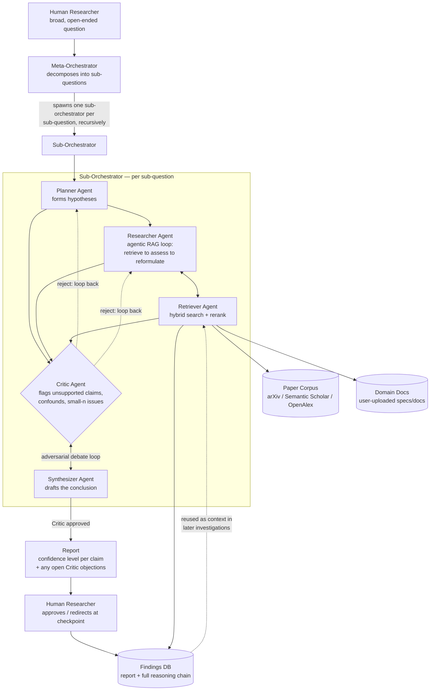

# Prometheus — Architecture

This is a living document. The diagram below is plain Mermaid text, so you can
edit it directly (in this file, in a Mermaid live editor, or have Claude
modify it) as the design evolves — no image-editing round trips required.

## Diagram

## Component notes

**Meta-Orchestrator** — entry point. Decomposes the broad question into
sub-questions and spawns a sub-orchestrator per sub-question. This is
recursive: a sub-orchestrator's findings can themselves spawn further
sub-questions, forming a tree. Aggregates all sub-reports into the final
report and owns the human-in-the-loop checkpoints.

**Sub-Orchestrator** — the unit of work for a single sub-question. Runs the
Planner → Researcher/Retriever → Critic ↔ Synthesizer sequence described
below, as a LangGraph `StateGraph` with a conditional edge on the Critic's
verdict.

**Planner Agent** — turns a sub-question into one or more testable
hypotheses. Re-entered when the Critic rejects a finding and sends it back
for reformulation.

**Researcher Agent** — drives the agentic RAG loop (retrieve → assess →
reformulate) against the Retriever Agent, deciding when evidence is
sufficient vs. when to reformulate and retry.

**Retriever Agent** — hybrid search (BM25 + dense vectors) across the four
data stores, cross-encoder reranking, then recency/source-credibility
filtering. Owns the routing logic that decides which store(s) a given query
should hit.

**Critic Agent** — adversarial check on the Synthesizer's draft: unsupported
claims, confounds, small-n issues. Debates with the Synthesizer; the
Synthesizer cannot finalize without Critic approval. Rejections loop back to
Planner or Researcher with concrete objections. (Needs a max-rounds guard to
avoid infinite debate — escalate to the human if exceeded.)

**Synthesizer Agent** — drafts the conclusion from gathered evidence,
revises it against Critic objections, and finalizes once approved.

**Report** — confidence level per claim, plus any objections the Critic
never fully resolved, surfaced to the human rather than hidden.

**Human Researcher** — final authority at every checkpoint (per the
proposal's core design principle: Prometheus accelerates and sharpens the
investigation, it does not replace judgment). Approves or redirects; on
approval, the full reasoning chain is saved to the Findings DB.

**Findings DB** — past reports *and* the reasoning chain behind each, reused
as context in later investigations (it's one of the Retriever Agent's four
stores, not just an audit log).

## Data stores (Retriever Agent's four targets)

1. **Paper corpus** — open-access papers from arXiv, Semantic Scholar, and
   OpenAlex, parsed with PyMuPDF.
2. **Project/domain docs** — specs/documentation the user uploads for the
   question at hand, chunked and embedded on ingestion.
3. **Findings DB** — past reports + reasoning chains (see above).
4. **Vector store** — the embedding index (ChromaDB or Qdrant) underlying
   dense search across (1) and (2); BM25 runs alongside it for lexical
   search, and the two are merged before cross-encoder reranking.

## Open design questions (track here as they get resolved)

- Chroma vs. Qdrant: start with Chroma (zero-infra, local) for Phase 0–2,
  decide before Phase 6 whether to switch for deployment.
- Max debate-loop rounds before forced escalation to the human.
- Recursion depth limit for the Meta-Orchestrator's sub-question tree.
- Per-role model/temperature settings (hypothesis generation likely wants
  higher temperature than structured critique).
